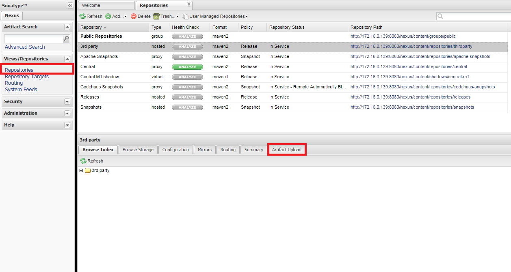
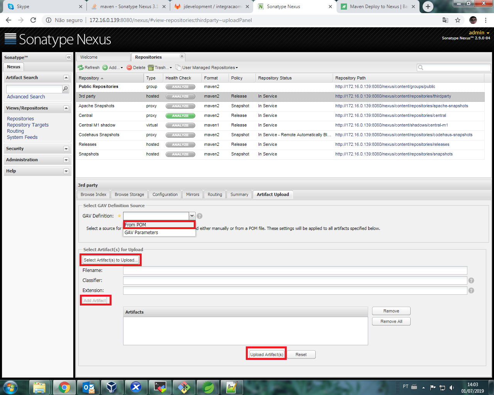

# TDV Spring Boot Archetype

### Como Criar um archeype novo

# Passos:

* Dar o comando  mvn clean install na pasta do seu projeto

* Dar o comando  mvn archetype:create-from-project

* Ir na pasta springbootarchetype\target\generated-sources\archetype abrir o POM.xml e editar colocando o mesmo nome do projeto nas tags artifactId  e name

* Ir na pasta springbootarchetype\target\generated-sources\archetype\target e mudar o nome do jar para o nome do projeto

* Conforme imagem vamos entrar no nexus http://172.16.0.139:8080/nexus/#welcome login admin senha duplode14 depois vamos clicar em repository e depois Artifact Upload 

   
   
* Conforme imagem vamos Selecionar a opção POM selecionar o pom da pasta springbootarchetype\target\generated-sources\archetype e selecionar o jar gerado da pasta springbootarchetype\target\generated-sources\archetype\target depois clicar em add artifact e por fim clicar em Upload

   
